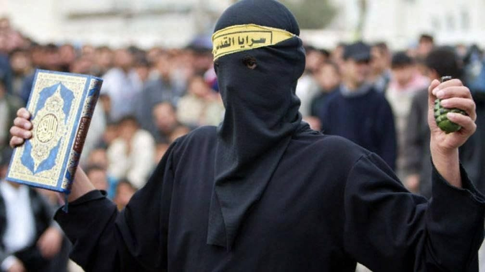
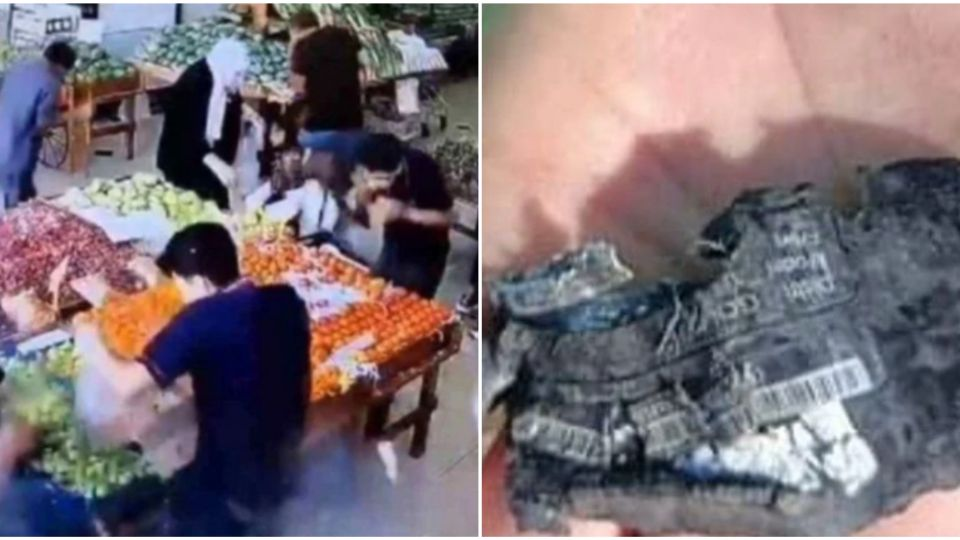
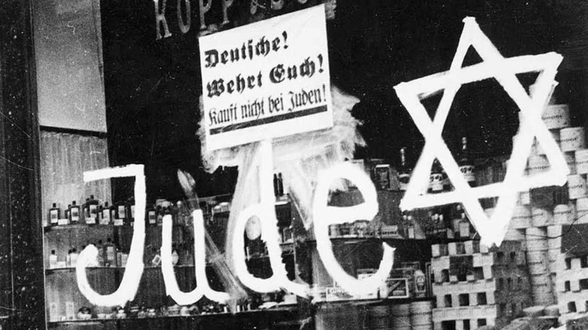
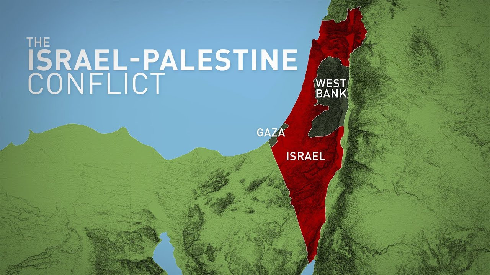
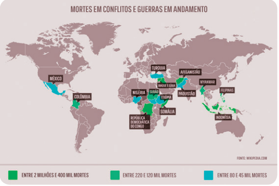

---
theme: black
format:
  revealjs
slide-level: 2
execution: "pandoc -t revealjs -s Resolução\ dos\ conflitos\ entre\ árabes\ e\ judeus.md -o Resolução-dos-conflitos-entre-arabes-e-judeus.html --slide-level=2"
header-includes: |
  
...

# Resolução dos conflitos entre árabes e judeus {data-background-image="img/judeu-arabe-amigos.jpg"}

::: {.posicionamento}
{ height=300px }
:::

## Escala do pensamento

- 💭 Pensamento 
	- ❓Questionamento
- 🗣️ Opinião
- ✊ Posicionamento

## Escala de posicionamento

- 🎞️/👄Oralidade 
- 📝 Escrita

# Como eu era antes do debate

## Israel é mais organizado e busca convívio pacífico 🗣️

* provavelmente cometeu resposta desproporcional

::: notes

- Invasão recente em que mataram e sequestraram os judeus

:::

## Maomé deixou um legado de guerra: A jihad 💭

* Morte aos Infiéis

 

## É justificável usar a força/inteligência contra quem está lhe atacando 🗣️

* Resposta tática de Israel: explosão de bips

## Os judeus foram perseguidos durante a segunda guerra 🗣️

## Judeus e Islâmicos são diferentes 🗣️

## Sempre existiu guerra entre os Judeus e os palestinos 💭

::: notes

- Sempre = desde de que eu nasci eu só vivenciei isso

:::

## A guerra entre Judeus e os Palestinos não me interessa 🗣️

:::::::::::::: {.columns}
::: {.column width="50%"}

:::
::: {.column width="40%"}

:::
::::::::::::::

::: notes

- **Guerra na Síria**: A guerra civil na Síria já dura mais de 10 anos, resultando em milhares de mortes e milhões de refugiados. O conflito teve início em 2011, com protestos contra o governo de Bashar al-Assad ¹.
- **Conflito no Afeganistão**: O Afeganistão enfrenta uma guerra civil desde a invasão liderada pelos EUA em 2001. Os principais envolvidos são o governo afegão, os talibãs e grupos extremistas ¹.
- **Conflito no Iêmen**: O Iêmen vive uma guerra civil desde 2014, com a intervenção de países como a Arábia Saudita. A população sofre com a fome e a falta de assistência humanitária ¹.
- **Conflito na Ucrânia**: A Ucrânia enfrenta uma crise desde 2014, com a anexação da Crimeia pela Rússia e conflitos no leste do país entre separatistas pró-russos e forças ucranianas ¹.
- **Conflito no Sudão do Sul**: O Sudão do Sul declarou independência em 2011, mas desde então enfrenta conflitos internos entre diferentes grupos étnicos, resultando em violência e deslocamento de civis ¹.
- **Conflito no Iraque**: O Iraque enfrenta a ameaça do Estado Islâmico desde 2014, com ataques terroristas e confrontos armados. A instabilidade política e étnica também contribuem para a crise ¹.
- **Conflito na República Democrática do Congo**: A República Democrática do Congo vive uma guerra civil desde 1996, com a participação de vários grupos armados e a disputa por recursos naturais ¹.

:::

## A Igreja católica resignifica os costumes de outros povos 🗣️

:::::::::::::: {.columns}
::: {.column width="40%"}

:::
::: {.column width="10%"}
 
:::
::::::::::::::

::: notes

A "páscoa pagã", mais precisamente conhecida como celebrações de **Ostara**, referia-se a festas da primavera em culturas pagãs, como as anglo-saxãs, germânicas e celtas, que celebraram a deusa da fertilidade e do renascimento, Eostre ou Ostara, com símbolos como coelhos e ovos, que foram incorporados ao cristianismo, mas com um significado cristão de ressurreição. 
**Saturnália**: Celebração romana em homenagem a Saturno, o deus do tempo, da agricultura e das coisas sobrenaturais. 

:::

# Como estou depois

## Árabe é a lingua 

* Idioma tem variações entre os povos e nações (como o espanhol na América Latina)

## Fátima, a filha de Mamoé  {data-background-image="img/santuario-de-fatima-1920x1080-1.jpg.webp"}

- Venerada pelos Islâmicos
- Origem do nome da Cidade de Fátima em Portugal
- Aparição de Fátima pode ter sido a filha de Maomé

## Similaridades religiosas

:::::::::::::: {.columns}
::: {.column width="50%"}
* Existe um Deus e ele está do meu lado
* A minha religião é a única verdade
* Bem vs o mal
:::
::: {.column width="50%"}
* Nós somos o povo escolhido
* Lealdade e defesa do meu grupo religioso
:::
::::::::::::::

## As crenças dos judeus e palestinos potencializam os conflitos

> existe uma terra prometida e temos direito a controlá-la;

> apego ao território: criação do estado de Israel após a II Guerra mundial

## O legado de Maomé pode ter sido corrompido❓

> Não tenho problemas com a crença belicista do alcorão💭

## As consciências/espíritos podem ser as mesmas

> Eles podem nascer/ressomar nos dois lados dos conflitos.

## É difícil perceber os nossos próprios condicionamentos

- Justificativa de guerras
- Viés dos fatos
- Desinteresse

## Eu sou a favor das consciências

> Além dos territórios e etnias, eu sou a favor da evolução de todos sem agravamento dos karmas.

# Contexto e posicionamentos ✊

## Contexto brasileiro

- Conservadores (cristãos): a favor de Israel
- Esquerdistas: a favor de palestina e Hammas
- **Libertário**
- **Conscienciólogo**

## Atributos dos intermissivistas

- **Paradiplomata**
- **Pacifista**

## Diplomata

- Como ser um diplomata para as conscins...
	- *com opiniões a favor de Israel*❓
	- com opiniões polarizadas na Palestina❓
	- *com viés religioso*❓
	- *que são indiferentes*❓

## Paradiplomata

- *O que é um paradiplomata*❓1️⃣
- Como ser um paradiplomata para as consciex...
	- que dessomaram nos conflitos❓
	- *com viés religioso*❓
	- *terrestre com passado bélico*❓
	- *extraterrestres com passado bélico*❓

## Pacifista

- *O que é um pacifista*❓
- Como eu posso ser um pacifista❓

## Prioridades ✊

::: {.posicionamento}

1️⃣ O que é um paradiplomata? 🎞️

2️⃣ O que é um pacifista? 🎞️

3️⃣ Artigo diplomático para conscins com viés pró-Israel. 📝

:::