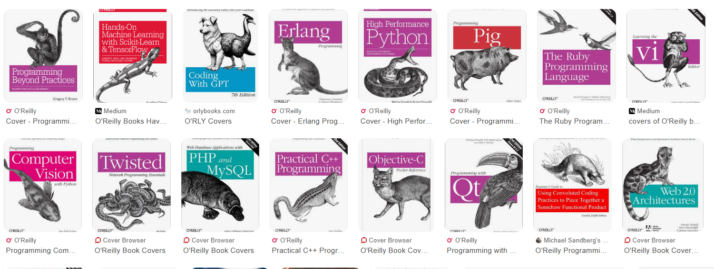

---
title: 'Technical Solutions for Books'
theme: black
format:
  revealjs
...

# Who am I?

- Eduardo de Santana Medeiros (eduardo.ufpb@gmail.com)
- Master's and Bachelor's degree in Computer Science
- From João Pessoa/Paraíba - Brazil.
- Traveled to: Canada, United States, Argentina, Mexico, Colombia, Peru, Foz do Iguaçu
- Catholic -> Spiritist -> Conscientiologist

## As a Software Developer

- The business rules dictate software
  - When rules change, software must follow
- We collaborate with our peers to keep the code running
  - All developers update code written by others
  - There is no single owner of the code
  - Each code update must be approved by a peer
- We use a lot of stuff other people created
  - We report errors to them
  - With a solution to solve our problem

## Collaboration Process

- A lot of online forums, blogs, Stack Overflow
- License permission to collaborate
- Code repository tools: Issues, Pull Requests
  - Groups and permissions to edit, access

## We Learn From

- Videos
- Books
- Tutorials/Guides
- Code repositories: issues reported
- Tests
- Source code

## Our Process

- There is an automated process to test software
- We release changes throughout the day
- Release software with errors
- Might keep a changelog
  - Semantic Versioning: v7.0.8.7

# An Experience with Book Production

## Pedagogy

:::::::::::::: {.columns}
::: {.column width="50%"}
- Hybrid course – Universidade Federal da Paraíba (Brazil)
- Printed books
- Interactive book
- Interactive CD-ROM (with offline content)
- Moodle: online platform for students/tutors/teachers
:::
::: {.column width="50%"}
{scale=0.5 height=600px}
:::
::::::::::::::

## Africanidades

- Multiple countries with Portuguese as the official language – Universidade Federal da Paraíba (Brazil)
- Printed books
- Interactive CD-ROM (with offline content)

## Biology

- Printed books
- Microsoft Word documents
  - 6 classes/disciplines per book

## InDesign – Tool for Book Design

- Understand possibilities and limitations

{scale=0.5 height=400px}

# The Problems

## The Process Flow

- Author — DOCX
  - Multiple authors
- Reviews — DOCX
- Design — InDesign document

## Consequences

- A lot of single-edition books
  - Nobody touches other people's text — *not comfortable making improvements*
- Low incentive for **active authors**
- Audience stuck with outdated information
- Book design gets into a queue — an entire book must be designed by a single person-machine-file
- The book is pretty

# A New Process

## Computer Science Course

- Process inspired by O'Reilly
- Technical books must be released quickly
- [Pretail books](https://en.wikipedia.org/wiki/Pretail) refer to books that focus on pre-launch or pre-commerce strategies 

:::: {.notes}

and tactics for introducing new products, services, and brands to the market, essentially exploring how to generate interest and demand before a product is officially released.

::::

## The New Process

- Every file goes into a central repository (with versioning)
- Source of book written in a lightweight markup language 
- **LaTeX** is used to produce the PDF document
  - Templates with preconfigured styles
- Feedback process
- Review feedback incorporated into the source of the book
- All versions of the books publicly available
  - Resources of the book available for download

## Sample

- [Introdução à Programação](https://github.com/ufpb-computacao/introducao-a-programacao-livro/tree/master)
- [Other repositories](https://github.com/orgs/ufpb-computacao/repositories)

## Results

- These books are still available after 11 years
- Teachers from other institutions wanted to collaborate
- Received a few feedbacks to improve
- Two flows:
  - Author writes in Word
  - Author accepts new tools
- I single-handedly handled the production of all books for the course
  - New versions of books anytime

## Arabic Glossary

**Attention translators** -- see the comments inside the source of the book

- [Arabic glossary](https://github.com/edusantana/glossario-arabe-conscienciologia)

# Improvements and Understanding

## License

- Using text without reference is a crime — it really is!

{scale=0.5 height=200px}

## Collaborate, collaborate, collaborate

- [Choose a copy left license](https://choosealicense.com/) that encourages collaboration
- We need a *legal cosmoethical license* for our books

## Release More, release often

- Release incomplete, with errors, release all the time
- Create a dedicated space for the book's audience
  - Engage the audience earlier, get feedback
  - Invite readers/peers to collaborate

## Institutional Books

- I am in favor of institutional books
- Make grupal gescons easier

## Translators

- Updates without caring too much about formatting
- Original language source lives inside, as comments
- The work will be easier If you learn new tools
  - We can show which lines were updated between two versions

## Optimize PDFs for screens (not only print)

- Use internal links no navigate in the document
- Add links to download content
- Also add QRCodes to content (useful for print)

## Kindle

- ePub (Kindle) is important too
- Reading a ePub file in phone is much better than read a PDF

## Resources Available Online

- Make resources available online (spreadsheets, slides)
- Allow teachers to use/edit for their needs

## Free distribution

- Books should be free to distribute
- You might request financial contribution inside the book
- Use books as a call for courses

## Integrate Marketing Tools

The book is another media from your campaign

The institution should be able to know its readers:

- Who is he/she?
- Which links did he/she open?
- When did they click?
- Where is the person? Which country? City?
- Which other books have they already read?
- Which topics are they interest?

## Security

- Books should be digitally certified by its Institution

## ISIC Operating Context

